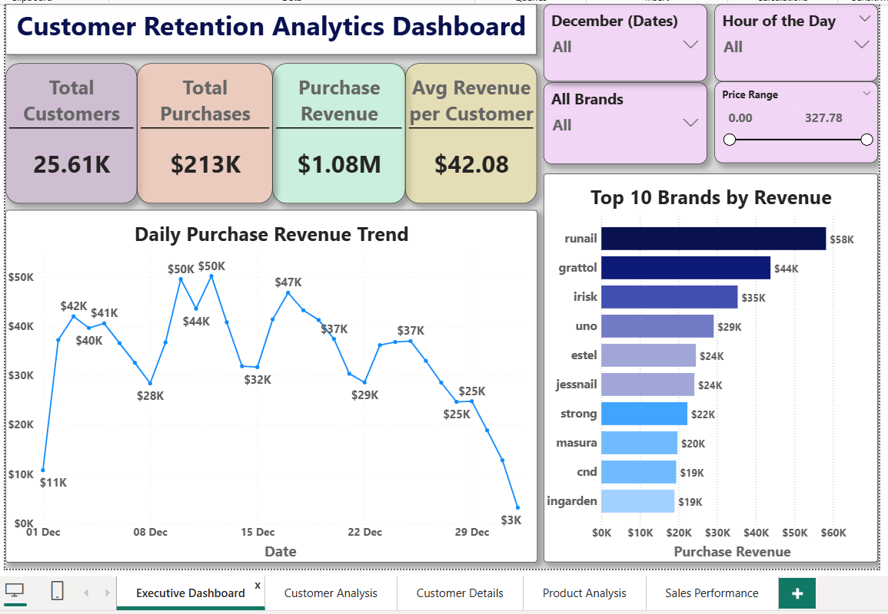
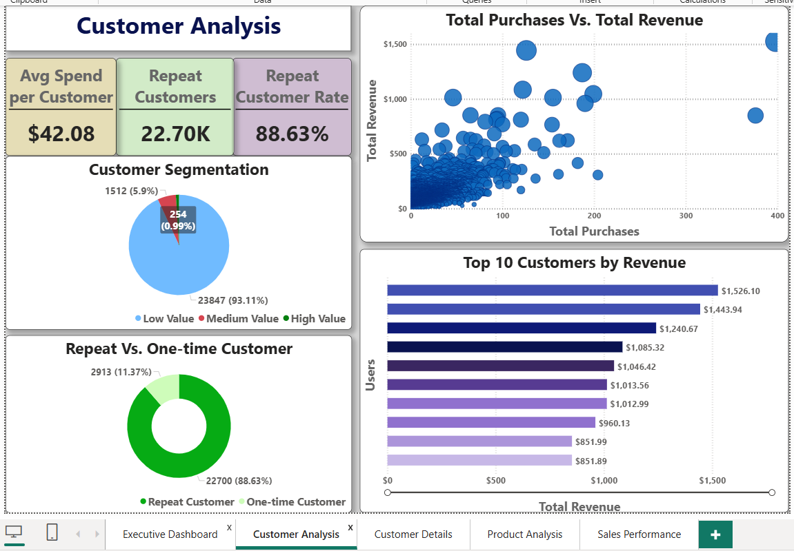
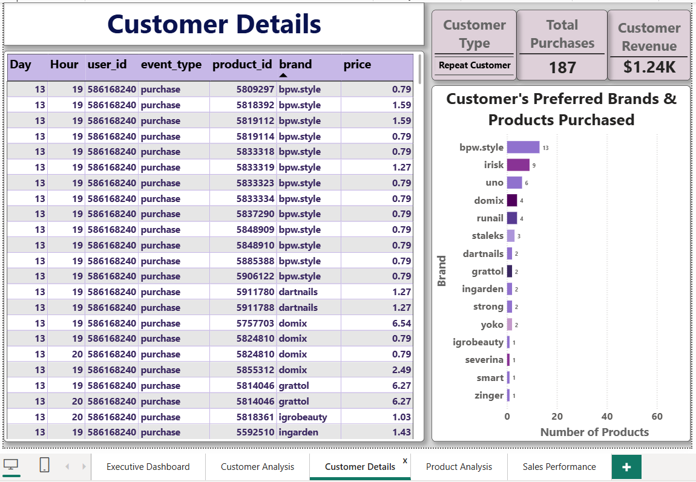
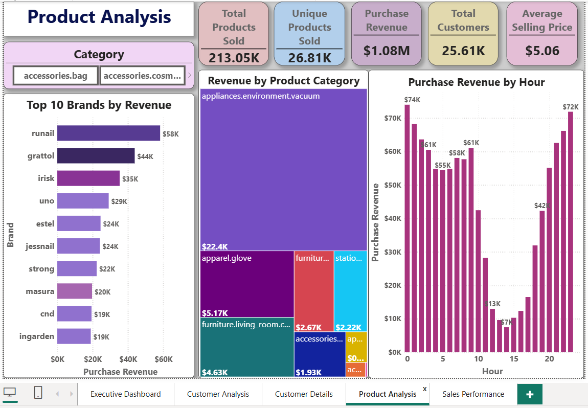
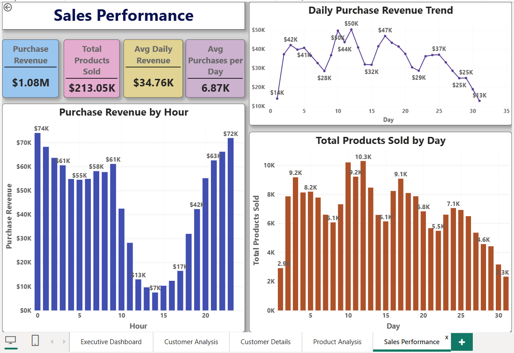

# 📊 Customer Retention Analytics Dashboard

> End-to-end retail analytics project using  **SQL, Python, Power BI** to analyze 3.3M+ e-commerce transactions, uncover customer retention patterns, product performance and sales insights.

---

## 📌 Project Overview 

Retail businesses collect millions of transaction records every month, but raw data alone cannot answer important business questions.

This project demonstrates a complete Business Intelligence workflow, beginning with raw transactional data and ending with interactive executive dashboards that support customer retention, sales optimisation, and product performance analysis.

The project covers the complete analytics lifecycle:

- Data Cleaning using Python (Pandas)
- Business Analysis using SQL
- Data Modelling
- DAX Measures
- Data Visualisation & Interactive Dashboard Development using Power BI
- Version Control using Git & GitHub

---

# 🎯 Business Problem

Retail organisations often struggle to answer questions such as:

- Who are our most valuable customers?
- Which customers are likely to return?
- Which brands generate the highest revenue?
- Which product categories perform best?
- What time of day generates maximum revenue?
- How does revenue change throughout the month?
- Which products contribute most to sales?

This project provides data-driven answers to these questions.

---

# 📂 Dataset

**Source**

Retail E-Commerce Dataset (Kaggle)

**Dataset Size**

- 3.3+ Million Records
- December Transaction Data
- Multiple Customer Events

Event Types

- Purchase
- View
- Cart
- Remove from Cart

For business analysis, purchase transactions were isolated and analysed separately.

---

# 🛠️ Technology Stack

| Tool | Purpose |
|-------|----------|
| Python (Pandas) | Data Cleaning & Preprocessing |
| SQL | Business Analysis |
| Power BI | Data Visualisation / Dashboard Development |
| Git | Version Control |
| GitHub | Portfolio & Collaboration |

---

# 🔄 Project Workflow

```
Raw Dataset
      │
      ▼
Python Data Cleaning
      │
      ▼
SQL Analysis
      │
      ▼
Power BI Data Model
      │
      ▼
DAX Measures
      │
      ▼
Interactive Dashboards
      │
      ▼
Business Insights
```

---

# 🧹 Data Cleaning (Python)

The raw dataset was cleaned using **Python (Pandas)**.

Cleaning steps included:

- Removed duplicate records
- Converted event timestamps into datetime format
- Extracted Date, Day and Hour
- Standardised column names
- Handled missing category values
- Filtered purchase transactions
- Exported cleaned dataset for SQL analysis

---

# 🗄 SQL Analysis

SQL was used to perform business analysis including:

- Customer Segmentation
- Repeat Customer Analysis
- Revenue Analysis
- Product Performance
- Brand Performance
- Daily Sales Analysis
- Purchase Behaviour
- Cohort Analysis
- Customer Lifetime Metrics

---

# 📈 Power BI Dashboards

The Power BI solution consists of five interactive dashboard pages.

---

# 1️⃣ Executive Dashboard

Provides a high-level overview of business performance.

### KPIs

- Total Customers
- Total Purchases
- Purchase Revenue
- Average Revenue per Customer

### Visualisations

- Daily Purchase Revenue Trend
- Top 10 Brands by Revenue

### Dashboard



---

# 2️⃣ Customer Analysis

Analyses customer purchasing behaviour.

### KPIs

- Average Spend per Customer
- Repeat Customers
- Repeat Customer Rate

### Visualisations

- Customer Segmentation
- Repeat vs One-time Customers
- Customer Purchase vs Revenue
- Top Customers by Revenue

### Dashboard



---

# 3️⃣ Customer Details (Drill-through)

Interactive drill-through page allowing detailed customer-level analysis.

Displays

- Purchase History
- Preferred Brands
- Purchased Products
- Customer Revenue
- Customer Type

### Dashboard



---

# 4️⃣ Product Analysis

Analyses overall product performance.

### KPIs

- Total Products Sold
- Unique Products Sold
- Purchase Revenue
- Average Selling Price
- Total Customers

### Visualisations

- Top Brands by Revenue
- Revenue by Product Category
- Revenue by Hour

### Dashboard



---

# 5️⃣ Sales Performance

Provides detailed sales trends over time.

### KPIs

- Purchase Revenue
- Total Products Sold
- Average Daily Revenue
- Average Purchases per Day

### Visualisations

- Daily Purchase Revenue Trend
- Revenue by Hour
- Products Sold by Day

### Dashboard



---

# 📊 DAX Measures Created

Some of the DAX measures developed include:

- Purchase Revenue
- Total Customers
- Total Purchases
- Average Revenue per Customer
- Repeat Customers
- Repeat Customer Rate
- Average Selling Price
- Unique Products Sold
- Total Products Sold
- Average Daily Revenue
- Average Purchases per Day

---

# 📈 Key Business Insights

### Customer Insights

- Approximately **88.6%** of customers were repeat customers.
- Repeat customers contributed the majority of revenue.
- High-value customers generated significantly greater revenue than average customers.

---

### Brand Insights

- A small number of brands contributed a large share of overall revenue.
- Revenue distribution follows a Pareto-style pattern.

---

### Product Insights

- Thousands of unique products were sold.
- Product categories contributed unevenly to total revenue.

---

### Sales Insights

- Revenue peaked during late evening hours.
- Daily revenue fluctuated throughout the month, indicating changing purchasing behaviour.

---

# 📁 Repository Structure

```
customer_retention_analytics_project/

│
├── dashboard_screenshots/
│   ├── executive_dashboard.png
│   ├── customer_analysis.png
│   ├── customer_details.png
│   ├── product_analysis.png
│   └── sales_performance.png
│
├── documentation/
│   └── project_documentation.docx
│
├── powerbi/
│   └── customer_retention_dashboard.pbix
│
├── python/
│
├── sql/
│
├── README.md
│
└── LICENSE
```

---

# 💼 Skills Demonstrated

- SQL
- Python
- Pandas
- Data Cleaning
- Data Transformation
- Data Modelling
- Power BI
- DAX
- Business Intelligence
- Customer Analytics
- Sales Analytics
- Dashboard Design
- Data Visualisation
- Git
- GitHub

---

# 🚀 Future Improvements

Potential enhancements include:

- Predictive Customer Churn Model
- RFM Segmentation
- Customer Lifetime Value (CLV)
- Recommendation Engine
- Forecasting using Machine Learning
- Automated Dashboard Refresh

---

# 👤 Author

**Navyatha Rai**
---

## ⭐ If you found this project interesting, consider giving it a star!
